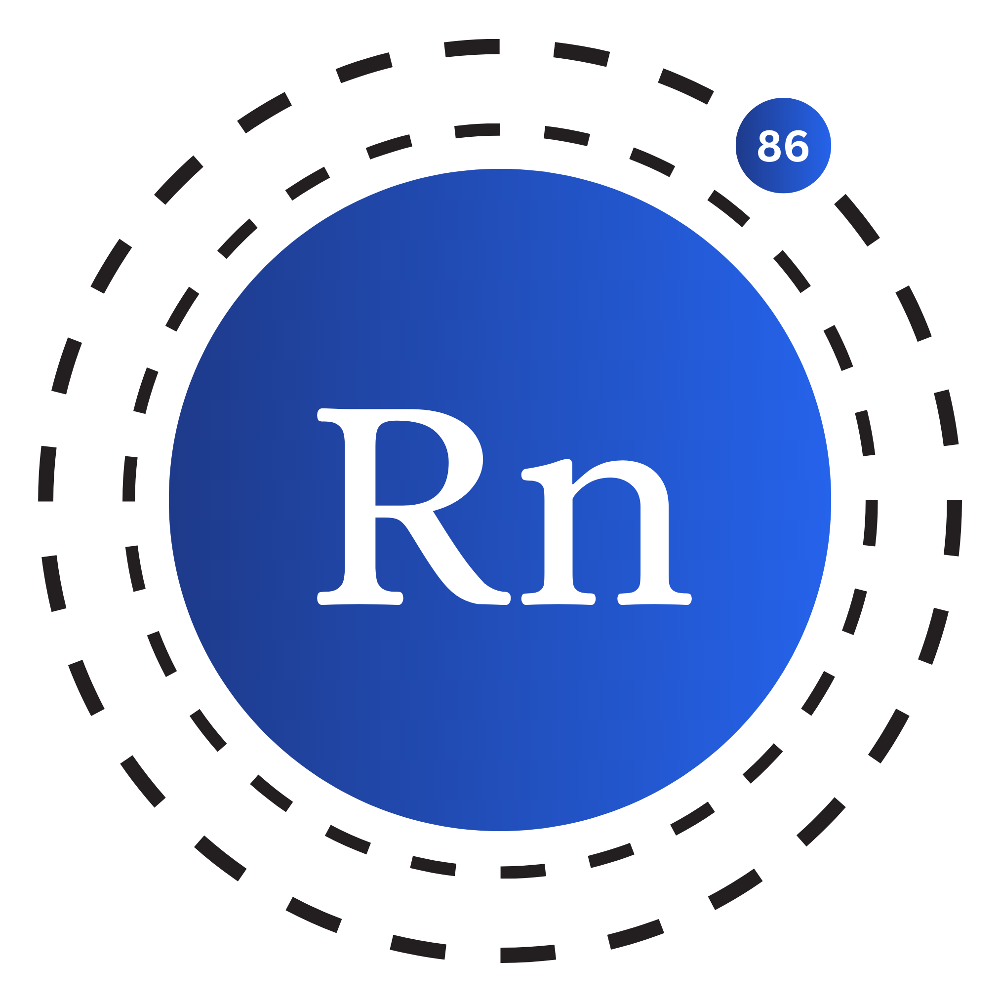

# The Radon Programming Language

<figure markdown="span">
  { width="300" }
  <figcaption>
    <a href="https://radon-project.github.io/">
        <strong>Radon</strong>
    </a> is a programming language that is designed to be easy to learn and use.
  </figcaption>
</figure>

Maintained by [Md. Almas Ali][almas]

[](https://hits.sh/radon-project.github.io/radon/)
[][github]
[][github]
[][github]
[][github]
[][github]
[][github]
[][github]
[](https://github.com/radon-project/radon/blob/master/LICENSE)

---

**Website**: [https://radon-project.github.io][web]{:target="\_blank"}

**Documentation**: [https://radon-project.github.io/docs][docs]{:target="\_blank"}

**Github**: [https://github.com/radon-project/radon][github]{:target="\_blank"}

---

## Introduction

Radon is a programming language that is designed to be easy to learn and use.
It is a high-level language intended to be used for general purpose programming.
It is designed to be easy to learn and use,
while still being powerful enough to be used for most tasks.

Some of the features of Radon include:

- A simple syntax that is easy to learn and use
- Dynamic typing so that you don't have to worry about types
- Powerful standard library that makes it easy to do common tasks (Development)
- Easy to use package manager that makes it easy to install packages (Future feature)
- Functional programming support
- Object-oriented programming support (Development)
- Easy to use concurrency support (Future feature)
- Easy to use GUI library (Future feature)
- Easy to use web development library (Future feature)
- Advanced command line interface (Development)
- Easy to use networking library (Future feature)
- Easy to use database library (Future feature)
- Easy to use graphics library (Future feature)

## Login Logic

```js linenums="1" title="Login.rn"
# This is a Radon test file for the Radon Programming Language.

class Network {
    fun __constructor__(username, password) {
        this.username = username
        this.password = password
    }

    fun login() {
        if this.username == "radon" {
            if this.password == "password" {
                print("Log in successful")
            }
        } else {
            print("Invalid credentials")
        }
    }
}

username = input("Enter you username: ")
password = input("Enter your password: ")

network = Network(username, password)
network.login()
```

## Sponsors

No sponsors yet. Be the first one to sponsor this project.
[Become a sponsor][contact]{:target="\_blank"}

[almas]: https://github.com/Almas-Ali "Md. Almas Ali"
[github]: https://github.com/radon-project/radon "Radon"
[web]: https://radon-project.github.io/ "web"
[docs]: https://radon-project.github.io/docs "Docs"
[contact]: https://linkedin.com/in/md-almasali "Contact the author"
